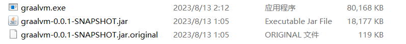
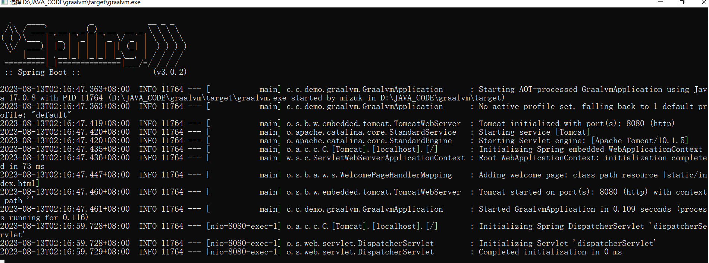
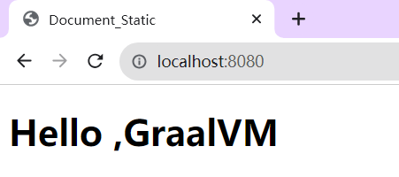

## Errors
### conflict between maven and java
**they must be the same!!**<br/>
`mvn -s ` and `java --version ` will result in different java version, although I can assign the JAVA_HOME in the mvn.cmd directly , the plugin still need the JAVA_HOME param . <br/>
 Finally, I modify the environment values for current user , not for the global and solve the conflict 

### Obsolete support 
update the native-plugin to the latest version can solve the below error

```js
d:\JAVA_CODE\graalvm>mvn -Pnative native:compile
Picked up JAVA_TOOL_OPTIONS: -Dfile.encoding=UTF-8 -Duser.language=en -Duser.country=US
[INFO] Scanning for projects...
[INFO]
[INFO] ---------------------< com.crossevol.demo:graalvm >---------------------
[INFO] Building graalvm 0.0.1-SNAPSHOT
[INFO]   from pom.xml
[INFO] --------------------------------[ pom ]---------------------------------
[INFO]
[INFO] >>> native:0.9.19:compile (default-cli) > package @ graalvm >>>
[INFO]
[INFO] --- native:0.9.19:add-reachability-metadata (add-reachability-metadata) @ graalvm ---
[INFO] [graalvm reachability metadata repository for ch.qos.logback:logback-classic:1.4.5]: Configuration directory not found. Trying latest version.
[INFO] [graalvm reachability metadata repository for ch.qos.logback:logback-classic:1.4.5]: Configuration directory is ch.qos.logback\logback-classic\1.4.1
[INFO] [graalvm reachability metadata repository for org.apache.tomcat.embed:tomcat-embed-core:10.1.5]: Configuration directory not found. Trying latest version.
[INFO] [graalvm reachability metadata repository for org.apache.tomcat.embed:tomcat-embed-core:10.1.5]: Configuration directory is org.apache.tomcat.embed\tomcat-embed-core\10.0.20
[INFO]
[INFO] --- spring-boot:3.0.2:process-aot (process-aot) @ graalvm ---
Picked up JAVA_TOOL_OPTIONS: -Dfile.encoding=UTF-8 -Duser.language=en -Duser.country=US

  .   ____          _            __ _ _
 /\\ / ___'_ __ _ _(_)_ __  __ _ \ \ \ \
( ( )\___ | '_ | '_| | '_ \/ _` | \ \ \ \
 \\/  ___)| |_)| | | | | || (_| |  ) ) ) )
  '  |____| .__|_| |_|_| |_\__, | / / / /
 =========|_|==============|___/=/_/_/_/
 :: Spring Boot ::                (v3.0.2)

2023-08-13T02:04:58.677+08:00  INFO 780 --- [           main] c.c.demo.graalvm.GraalvmApplication      : Starting GraalvmApplication using Java 17.0.8 with PID 780 (D:\JAVA_CODE\graalvm\target\classes started by mizuk in d:\JAVA_CODE\graalvm)
2023-08-13T02:04:58.682+08:00  INFO 780 --- [           main] c.c.demo.graalvm.GraalvmApplication      : No active profile set, falling back to 1 default profile: "default"
[INFO]
[INFO] --- spring-boot:3.0.2:repackage (repackage) @ graalvm ---
[INFO]
[INFO] <<< native:0.9.19:compile (default-cli) < package @ graalvm <<<
[INFO]
[INFO]
[INFO] --- native:0.9.19:compile (default-cli) @ graalvm ---
[INFO] Found GraalVM installation from JAVA_HOME variable.
[INFO] ------------------------------------------------------------------------
[INFO] BUILD FAILURE
[INFO] ------------------------------------------------------------------------
[INFO] Total time:  5.740 s
[INFO] Finished at: 2023-08-13T02:05:02+08:00
[INFO] ------------------------------------------------------------------------
[ERROR] Failed to execute goal org.graalvm.buildtools:native-maven-plugin:0.9.19:compile (default-cli) on project graalvm: Execution default-cli of goal org.graalvm.buildtools:native-maven-plugin:0.9.19:compile failed: Version to check 'native-image 17.0.8 2023-07-18
[ERROR] GraalVM Runtime Environment Oracle GraalVM 17.0.8+9.1 (build 17.0.8+9-LTS-jvmci-23.0-b14)
[ERROR] Substrate VM Oracle GraalVM 17.0.8+9.1 (build 17.0.8+9-LTS, serial gc, compressed references)' can't be parsed.
[ERROR] -> [Help 1]
[ERROR]
[ERROR] To see the full stack trace of the errors, re-run Maven with the -e switch.
[ERROR] Re-run Maven using the -X switch to enable full debug logging.
[ERROR]
[ERROR] For more information about the errors and possible solutions, please read the following articles:
[ERROR] [Help 1] http://cwiki.apache.org/confluence/display/MAVEN/PluginExecutionException
```

## Success Result
```js
d:\JAVA_CODE\graalvm>mvn -Pnative native:compile
Picked up JAVA_TOOL_OPTIONS: -Dfile.encoding=UTF-8 -Duser.language=en -Duser.country=US
[INFO] Scanning for projects...
[INFO]
[INFO] ---------------------< com.crossevol.demo:graalvm >---------------------
[INFO] Building graalvm 0.0.1-SNAPSHOT
[INFO]   from pom.xml
[INFO] --------------------------------[ pom ]---------------------------------
[INFO]
[INFO] >>> native:0.9.23:compile (default-cli) > package @ graalvm >>>
[INFO]
[INFO] --- native:0.9.23:add-reachability-metadata (add-reachability-metadata) @ graalvm ---
Downloading from aliyunmaven: https://maven.aliyun.com/repository/public/org/graalvm/buildtools/graalvm-reachability-metadata/0.9.23/graalvm-reachability-metadata-0.9.23-repository.zip
Downloaded from aliyunmaven: https://maven.aliyun.com/repository/public/org/graalvm/buildtools/graalvm-reachability-metadata/0.9.23/graalvm-reachability-metadata-0.9.23-repository.zip (198 kB at 142 kB/s)
[INFO] Downloaded GraalVM reachability metadata repository from file:/D:/DevTools/Maven/repository/org/graalvm/buildtools/graalvm-reachability-metadata/0.9.23/graalvm-reachability-metadata-0.9.23-repository.zip
[INFO] [graalvm reachability metadata repository for ch.qos.logback:logback-classic:1.4.5]: Configuration directory not found. Trying latest version.
[INFO] [graalvm reachability metadata repository for ch.qos.logback:logback-classic:1.4.5]: Configuration directory is ch.qos.logback\logback-classic\1.4.1
[INFO] [graalvm reachability metadata repository for org.apache.tomcat.embed:tomcat-embed-core:10.1.5]: Configuration directory not found. Trying latest version.
[INFO] [graalvm reachability metadata repository for org.apache.tomcat.embed:tomcat-embed-core:10.1.5]: Configuration directory is org.apache.tomcat.embed\tomcat-embed-core\10.0.20
[INFO]
[INFO] --- spring-boot:3.0.2:process-aot (process-aot) @ graalvm ---
Picked up JAVA_TOOL_OPTIONS: -Dfile.encoding=UTF-8 -Duser.language=en -Duser.country=US

  .   ____          _            __ _ _
 /\\ / ___'_ __ _ _(_)_ __  __ _ \ \ \ \
( ( )\___ | '_ | '_| | '_ \/ _` | \ \ \ \
 \\/  ___)| |_)| | | | | || (_| |  ) ) ) )
  '  |____| .__|_| |_|_| |_\__, | / / / /
 =========|_|==============|___/=/_/_/_/
 :: Spring Boot ::                (v3.0.2)

2023-08-13T02:08:20.151+08:00  INFO 21728 --- [           main] c.c.demo.graalvm.GraalvmApplication      : Starting GraalvmApplication using Java 17.0.8 with PID 21728 (D:\JAVA_CODE\graalvm\target\classes started by mizuk in d:\JAVA_CODE\graalvm)
2023-08-13T02:08:20.155+08:00  INFO 21728 --- [           main] c.c.demo.graalvm.GraalvmApplication      : No active profile set, falling back to 1 default profile: "default"
[INFO]
[INFO] --- spring-boot:3.0.2:repackage (repackage) @ graalvm ---
[INFO]
[INFO] <<< native:0.9.23:compile (default-cli) < package @ graalvm <<<
[INFO]
[INFO]
[INFO] --- native:0.9.23:compile (default-cli) @ graalvm ---
[INFO] Found GraalVM installation from JAVA_HOME variable.
[INFO] [graalvm reachability metadata repository for ch.qos.logback:logback-classic:1.4.5]: Configuration directory not found. Trying latest version.
[INFO] [graalvm reachability metadata repository for ch.qos.logback:logback-classic:1.4.5]: Configuration directory is ch.qos.logback\logback-classic\1.4.1
[INFO] [graalvm reachability metadata repository for org.apache.tomcat.embed:tomcat-embed-core:10.1.5]: Configuration directory not found. Trying latest version.
[INFO] [graalvm reachability metadata repository for org.apache.tomcat.embed:tomcat-embed-core:10.1.5]: Configuration directory is org.apache.tomcat.embed\tomcat-embed-core\10.0.20
[INFO] Executing: D:\DevTools\graalVM\graalvm-jdk-17_windows-x64_bin\bin\native-image.cmd @target\tmp\native-image-8408804096869315099.args
========================================================================================================================
GraalVM Native Image: Generating 'graalvm' (executable)...
========================================================================================================================
For detailed information and explanations on the build output, visit:
https://github.com/oracle/graal/blob/master/docs/reference-manual/native-image/BuildOutput.md
------------------------------------------------------------------------------------------------------------------------
[1/8] Initializing...                                                                                    (8.6s @ 0.16GB)
 Java version: 17.0.8+9-LTS, vendor version: Oracle GraalVM 17.0.8+9.1
 Graal compiler: optimization level: 2, target machine: x86-64-v3, PGO: ML-inferred
 C compiler: cl.exe (microsoft, x64, 19.37.32822)
 Garbage collector: Serial GC (max heap size: 80% of RAM)
 1 user-specific feature(s)
 - org.springframework.aot.nativex.feature.PreComputeFieldFeature
Field org.apache.commons.logging.LogAdapter#log4jSpiPresent set to true at build time
Field org.apache.commons.logging.LogAdapter#log4jSlf4jProviderPresent set to true at build time
Field org.apache.commons.logging.LogAdapter#slf4jSpiPresent set to true at build time
Field org.apache.commons.logging.LogAdapter#slf4jApiPresent set to true at build time
Field org.springframework.web.servlet.config.annotation.WebMvcConfigurationSupport#romePresent set to false at build time
Field org.springframework.web.servlet.config.annotation.WebMvcConfigurationSupport#jaxb2Present set to false at build time
Field org.springframework.web.servlet.config.annotation.WebMvcConfigurationSupport#jackson2Present set to true at build time
Field org.springframework.web.servlet.config.annotation.WebMvcConfigurationSupport#jackson2XmlPresent set to false at build time
Field org.springframework.web.servlet.config.annotation.WebMvcConfigurationSupport#jackson2SmilePresent set to false at build time
Field org.springframework.web.servlet.config.annotation.WebMvcConfigurationSupport#jackson2CborPresent set to false at build time
Field org.springframework.web.servlet.config.annotation.WebMvcConfigurationSupport#gsonPresent set to false at build time
Field org.springframework.web.servlet.config.annotation.WebMvcConfigurationSupport#jsonbPresent set to false at build time
Field org.springframework.web.servlet.config.annotation.WebMvcConfigurationSupport#kotlinSerializationCborPresent set to false at build time
Field org.springframework.web.servlet.config.annotation.WebMvcConfigurationSupport#kotlinSerializationJsonPresent set to false at build time
Field org.springframework.web.servlet.config.annotation.WebMvcConfigurationSupport#kotlinSerializationProtobufPresent set to false at build time
Field org.springframework.core.NativeDetector#imageCode set to true at build time
Field org.springframework.boot.logging.log4j2.Log4J2LoggingSystem$Factory#PRESENT set to false at build time
Field org.springframework.core.KotlinDetector#kotlinPresent set to false at build time
Field org.springframework.core.KotlinDetector#kotlinReflectPresent set to false at build time
Field org.springframework.boot.logging.java.JavaLoggingSystem$Factory#PRESENT set to true at build time
Field org.springframework.boot.logging.logback.LogbackLoggingSystem$Factory#PRESENT set to true at build time
Field org.springframework.cglib.core.AbstractClassGenerator#imageCode set to true at build time
Field org.springframework.web.context.support.StandardServletEnvironment#jndiPresent set to true at build time
Field org.springframework.web.client.RestTemplate#romePresent set to false at build time
Field org.springframework.web.client.RestTemplate#jaxb2Present set to false at build time
Field org.springframework.web.client.RestTemplate#jackson2Present set to true at build time
Field org.springframework.web.client.RestTemplate#jackson2XmlPresent set to false at build time
Field org.springframework.web.client.RestTemplate#jackson2SmilePresent set to false at build time
Field org.springframework.web.client.RestTemplate#jackson2CborPresent set to false at build time
Field org.springframework.web.client.RestTemplate#gsonPresent set to false at build time
Field org.springframework.web.client.RestTemplate#jsonbPresent set to false at build time
Field org.springframework.web.client.RestTemplate#kotlinSerializationCborPresent set to false at build time
Field org.springframework.web.client.RestTemplate#kotlinSerializationJsonPresent set to false at build time
Field org.springframework.web.client.RestTemplate#kotlinSerializationProtobufPresent set to false at build time
Field org.springframework.format.support.DefaultFormattingConversionService#jsr354Present set to false at build time
Field org.springframework.web.context.support.WebApplicationContextUtils#jsfPresent set to false at build time
Field org.springframework.web.context.request.RequestContextHolder#jsfPresent set to false at build time
Field org.springframework.boot.logging.logback.LogbackLoggingSystemProperties#JBOSS_LOGGING_PRESENT set to false at build time
Field org.springframework.http.converter.support.AllEncompassingFormHttpMessageConverter#jaxb2Present set to false at build time
Field org.springframework.http.converter.support.AllEncompassingFormHttpMessageConverter#jackson2Present set to true at build time
Field org.springframework.http.converter.support.AllEncompassingFormHttpMessageConverter#jackson2XmlPresent set to false at build time
Field org.springframework.http.converter.support.AllEncompassingFormHttpMessageConverter#jackson2SmilePresent set to false at build time
Field org.springframework.http.converter.support.AllEncompassingFormHttpMessageConverter#gsonPresent set to false at build time
Field org.springframework.http.converter.support.AllEncompassingFormHttpMessageConverter#jsonbPresent set to false at build time
Field org.springframework.http.converter.support.AllEncompassingFormHttpMessageConverter#kotlinSerializationCborPresent set to false at build time
Field org.springframework.http.converter.support.AllEncompassingFormHttpMessageConverter#kotlinSerializationJsonPresent set to false at build time
Field org.springframework.http.converter.support.AllEncompassingFormHttpMessageConverter#kotlinSerializationProtobufPresent set to false at build time
Field org.springframework.boot.autoconfigure.web.format.WebConversionService#JSR_354_PRESENT set to false at build time
Field org.springframework.context.event.ApplicationListenerMethodAdapter#reactiveStreamsPresent set to false at build time
Field org.springframework.web.servlet.view.InternalResourceViewResolver#jstlPresent set to false at build time
Field org.springframework.core.ReactiveAdapterRegistry#reactorPresent set to false at build time
Field org.springframework.core.ReactiveAdapterRegistry#rxjava3Present set to false at build time
Field org.springframework.core.ReactiveAdapterRegistry#kotlinCoroutinesPresent set to false at build time
Field org.springframework.core.ReactiveAdapterRegistry#mutinyPresent set to false at build time
SLF4J: No SLF4J providers were found.
SLF4J: Defaulting to no-operation (NOP) logger implementation
SLF4J: See https://www.slf4j.org/codes.html#noProviders for further details.
Field org.springframework.web.servlet.mvc.method.annotation.ReactiveTypeHandler#isContextPropagationPresent set to false at build time
Field org.springframework.web.servlet.support.RequestContext#jstlPresent set to false at build time
[2/8] Performing analysis...  [******]                                                                  (55.4s @ 1.66GB)
  15,017 (90.32%) of 16,627 types reachable
  24,793 (67.30%) of 36,838 fields reachable
  81,748 (65.64%) of 124,540 methods reachable
   4,639 types,   159 fields, and 3,780 methods registered for reflection
      83 types,    78 fields, and    68 methods registered for JNI access
       5 native libraries: crypt32, ncrypt, psapi, version, winhttp
[3/8] Building universe...                                                                               (6.6s @ 1.62GB)
[4/8] Parsing methods...      [****]                                                                    (17.4s @ 2.06GB)
[5/8] Inlining methods...     [****]                                                                     (2.6s @ 1.98GB)
[6/8] Compiling methods...    [***********]                                                            (134.2s @ 2.16GB)
[7/8] Layouting methods...    [***]                                                                      (8.4s @ 2.28GB)
[8/8] Creating image...       [***]                                                                      (6.3s @ 1.90GB)
  48.13MB (61.47%) for code area:    46,642 compilation units
  29.51MB (37.69%) for image heap:  379,410 objects and 117 resources
 670.91kB ( 0.84%) for other data
  78.29MB in total
------------------------------------------------------------------------------------------------------------------------
Top 10 origins of code area:                                Top 10 object types in image heap:
  17.01MB java.base                                           10.12MB byte[] for code metadata
   5.39MB tomcat-embed-core-10.1.5.jar                         3.61MB byte[] for java.lang.String
   4.76MB svm.jar (Native Image)                               2.80MB java.lang.String
   3.46MB java.xml                                             2.66MB java.lang.Class
   2.50MB jackson-databind-2.14.1.jar                          2.62MB byte[] for general heap data
   2.28MB spring-core-6.0.4.jar                              916.28kB byte[] for reflection metadata
   1.82MB spring-boot-3.0.2.jar                              774.99kB byte[] for embedded resources
 911.76kB spring-web-6.0.4.jar                               703.92kB com.oracle.svm.core.hub.DynamicHubCompanion
 875.87kB spring-beans-6.0.4.jar                             430.03kB c.o.svm.core.hub.DynamicHub$ReflectionMetadata
 752.54kB logback-core-1.4.5.jar                             414.88kB java.util.HashMap$Node
   8.10MB for 69 more packages                                 3.73MB for 3073 more object types
------------------------------------------------------------------------------------------------------------------------
Recommendations:
 PGO:  Use Profile-Guided Optimizations ('--pgo') for improved throughput.
 HEAP: Set max heap for improved and more predictable memory usage.
 CPU:  Enable more CPU features with '-march=native' for improved performance.
 QBM:  Use the quick build mode ('-Ob') to speed up builds during development.
 BRPT: Try out the new build reports with '-H:+BuildReport'.
------------------------------------------------------------------------------------------------------------------------
                       12.1s (5.0% of total time) in 188 GCs | Peak RSS: 4.06GB | CPU load: 9.20
------------------------------------------------------------------------------------------------------------------------
Produced artifacts:
 d:\JAVA_CODE\graalvm\target\graalvm.exe (executable)
========================================================================================================================
Finished generating 'graalvm' in 4m 0s.
[INFO] ------------------------------------------------------------------------
[INFO] BUILD SUCCESS
[INFO] ------------------------------------------------------------------------
[INFO] Total time:  04:11 min
[INFO] Finished at: 2023-08-13T02:12:27+08:00
[INFO] ------------------------------------------------------------------------
```

## executable file



启动时速度很快,立刻加载了所有资源

访问静态资源正常


访问api正常
